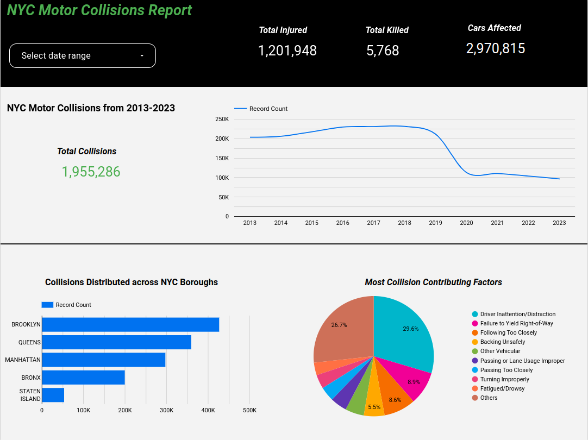

# NYC Motor Collisions Analytics

## Problem

This project analyzes motor collisions in NYC City from 2013 to 2023 to find out how many collisions happened each year and how many people were killed and injured each year besides knowing the most common causes of collisions.

## Data Source

the chosen datasets are from NYC Open Data Site which are [Motor Vehicle Collisions - Crashes](https://data.cityofnewyork.us/Public-Safety/Motor-Vehicle-Collisions-Crashes/h9gi-nx95/about_data) and [Motor Vehicle Collisions - Person](https://data.cityofnewyork.us/Public-Safety/Motor-Vehicle-Collisions-Person/f55k-p6yu/about_data).

## Dashboard Preview

[DashBoard Link](https://lookerstudio.google.com/reporting/62a98bd3-48cd-4e50-8aa2-fe19651e546a)



## Project Implementation

### Terraform

Terraform is used to create resources in GCP, which are Google Cloud Storage Bucket, and BigQuery datasets

### MAGE

MAGE is used as data orchestration to load data from NYC Open Data and load it to Google Cloud Storage and BigQuery

### DBT

DBT platform is used to make some transformations on data that is stored in BigQuery and create dimension and fact tables.

### Looker Studio

Looker Studio is used to create dashboards on the fact tables that we create using DBT.

### Project workflow


## Data modeling

in this project, I use star schema to model the data, with the following dimensions and fact tables

- **Dimension Tables**:
  - **dim_persons**: This table contains information about people involved in motor vehicle collisions such as sex, age, type, injury, age, etc.)
  - **dim_vehicles**: This table contains information about vehicles involved in motor vehicle collisions (make, model, etc.)
  - **dim_contributors**: This table contains information about contributing factors that lead to motor vehicle collisions
- **Fact Tables**:
  - **fact_crashes**: This table contains information about crashes in NYC City from 2013 to 2023 and how many people were killed and injured in each collision and the number of vehicles involved in each crash, also it contains information about contributing factors that lead to motor vehicle collisions

## Installation

to run this project locally you should have the following prerequisites

- [Docker](https://docs.docker.com/get-docker/)
- [Docker Compose](https://docs.docker.com/compose/install/)
- [Google Cloud SDK](https://cloud.google.com/sdk)
- [Terraform](https://www.terraform.io)
- [MAGE](https://www.mage.ai/)
- [DBT](https://docs.getdbt.com/docs/cloud/about-cloud-setup)
- [Looker Studio](https://lookerstudio.google.com)

### Create GCP resource

> You should have a billing account in GCP

1. Create a GCP project

2. Create a service account with the following rules
   1. `Big Query Admin`
   2. `Storage Admin`
   3. `Storage Object Admin`
   4. `Viewer`
3. Download the service account credentials file to your machine
4. clone this repository

```bash
   git clone https://github.com/mostafanasser2000/NYC-Motor-Collisions-Analytics.git
```

5. open the repo with any IDE and create a keys folder

```bash
   mkdir keys
```

6. move the credentials file to the keys folder
7. update file `terraform/variable.tf` with your credentials file path and your GCP project ID move to the `terraform` directory and run the following command

```bash
   terraform init
   terraform apply
```

8. if all the previous steps work well you should have those resources created in your GCP project
   - GCP Bucket with the name `motor-vehicle-collisions-bucket`
   - BigQuery Dataset with the name `nyc_motor_vehicle_collisions_raw`
   - BigQuery Dataset with the name `nyc_motor_vehicle_collisions_analytics`

> If you get an error in Terraform, you should check if you have `terraform` installed or `terraform` in your PATH.

### Configure MAGE

1. clone the mage repository to your machine

```bash
   git clone https://github.com/mage-ai/mage-zoomcamp
```

2. configure your service account credentials file in mage by changing `<credential file path>` in the `docker-compose.yml` file in the mage repo that you clone with the actual path in your computer

```bash
 - <credential file path>:/home/src/personal-gcp.json
```

3. move to the mage repository and run the following command

```bash
docker-compose up -d
```

4. open this link `http://localhost:6789` in your browser
   > If you have an error with docker or docker-compose, ensure you install, docker, and docker-compose correctly and add them to your path
5. change the GCP configuration setting in mage in the `io_config.yml` file
   
   change this code

```yml
# Google
... additional lines
```

to this

```yml
# Google
GOOGLE_SERVICE_ACC_KEY_FILEPATH: "/home/src/personal-gcp.json"
GOOGLE_LOCATION: EU # Optional
```

6. create a pipeline by uploading the zip file `MAGE/ingest_motor_vehicle_collisions.zip` to mage
   

7. run the pipeline, after all, pipeline blocks run you should have the `crashes.pq` and `person.pq` files in your GCP bucket, and the `persons` and `crashes` tables in your BigQuery.

### DBT

you can watch this video to understand how to create a DBT project with BigQueryConnection [dbt Cloud and BigQuery for Admins
](https://courses.getdbt.com/courses/dbt-cloud-and-bigquery-for-admins)

1. create a service account for the DBT Project with the following rules
   - `BigQuery Data Editor`
   - `BigQuery Job User`
   - `BigQuery Data Viewer`
2. download the service account key to your local machine
   > [!NOTE]
   > Before creating a dbt project fork this repo to your git hub and when creating a project choose the `dbt` folder from your fork as a subdirectory for your DBT project so you don't have to recreate models again.
3. create a DBT project with a BigQuery connection
4. run the following command in DBT Cloud IDE
   ```bash
   dbt run
   ```
5. if all steps go well all dimensions and fact tables should be created in your BigQuery dataset and you export them to Looker.
